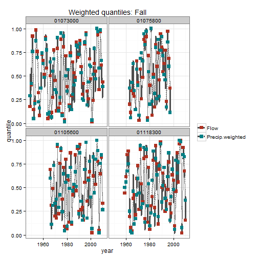

# Seasonal flow timeseries model<br> from paired flow and meterological/weather record
## 
## Exploratory Data Analysis: comparison of precipitation vs flow quantiles
## ALR July 2014<br>Conte Anadromous Fish Research Center
##   

### Load libraries, functions, etc


```r
library(lme4)
```

```
## Loading required package: Matrix
## Loading required package: Rcpp
```

```r
library(plyr)
library(ggplot2)
library(reshape2)
library(sp)
library(devtools)
```

```
## WARNING: Rtools is required to build R packages, but is not currently installed.
## 
## Please download and install Rtools 3.1 from http://cran.r-project.org/bin/windows/Rtools/ and then run find_rtools().
## 
## Attaching package: 'devtools'
## 
## The following objects are masked from 'package:utils':
## 
##     ?, help
## 
## The following object is masked from 'package:base':
## 
##     system.file
```

```r
model_dir<-"C:/ALR/Models/MetToFlow"
model_data_dir<-"C:/ALR/Models_processed_data"


#utility functions, load (source) from my saved gist
source_gist("https://gist.github.com/anarosner/ba285306fc0ce9d812a5", sha1="b25a1b73e02cc2b2d2c590f6c0b2c9c9945fa980")
```

```
## Sourcing https://gist.githubusercontent.com/anarosner/ba285306fc0ce9d812a5/raw/48b3efa59d36c7dceacf9c1c0a6fd77ca20bfdb5/util.r
```


```r
setwd(file.path(model_data_dir,"flow_timeseries"))

load("gages_char_spatial.Rdata")
long_site_no<-gages.char.spatial$site_no[gages.char.spatial$qannual>=30 & gages.char.spatial$TNC_DamCount==0]
length(long_site_no)
```

```
## [1] 4
```

```r
View(t(gages.char.spatial@data[gages.char.spatial$site_no %in% long_site_no,]))

load("dseasonal.Rdata")
dseasonal.long<-dseasonal[dseasonal$site_no %in% long_site_no,]
dseasonal.long<-subset(dseasonal.long,subset=!is.na(precip.e) & !is.na(precip.e.lag1) & !is.na(precip.e.lag2) )
# dseasonal.long[is.na(dseasonal.long$precip.e.lag2),]
# dim(dseasonal.long)


# 1 = Complete barrier to all fish (12+ feet)
# 2 = Small dam barrier (1-12 feet)
# 3 = Partial breach
# 4 = Barrier with fish ladder
# 5 = Unlikely barrier - fully breached, weir, under 1ft dam (also COND=NO DAM or COND=REM or COND=DEL)
# 6 = Unknown, assumed full barriers
# 7 = Locks
```


```r
basic<-lmer(log(flow) ~ 
              log(da_sqkm) +
               precip.e +  precip.e.lag1 + precip.e.lag2 +    #precip.e.lag3 + 
               (1|year)+(1|site_no),
          na.action=NULL, #to ensure we attached fitted values w/ correct site_no
         data=dseasonal.long) 

season.names<-c("winter","spring","summer","fall")
# basic.season<-list()
weights<-as.data.frame(matrix(nrow=4,ncol=3))

for (i in 1:length(season.names)) {
     temp<-update(basic, subset=season==season.names[i])
     weights[i,]<-fixef(temp)[c("precip.e", "precip.e.lag1", "precip.e.lag2")]/
          sum(fixef(temp)[c("precip.e", "precip.e.lag1", "precip.e.lag2")])
#      basic.season[season.names[i]]<-temp
}
row.names(weights)<-season.names
names(weights)<-c("precip.e", "precip.e.lag1", "precip.e.lag2")

weights
```

```
##        precip.e precip.e.lag1 precip.e.lag2
## winter   0.6140        0.2744     1.116e-01
## spring   0.7416        0.1889     6.954e-02
## summer   0.7856        0.1501     6.433e-02
## fall     0.7362        0.2639    -7.586e-05
```

### compare precip vs flow quantiles from sites w long records

```r
# 4 sites, 4 seasons

rm(quant.melt)
for (i in long_site_no) {
#      i<-long_site_no[2]
     print(i)
     for (j in 1:length(season.names)) {
          print(j)
          print(season.names[j])
          temp<-dseasonal.long[dseasonal.long$site_no == i &
                                    dseasonal.long$season==season.names[j],
                            c("precip.e","precip.e.lag1","precip.e.lag2","flow","year")]
          temp.weighted<-temp[,1]*weights[j,1] + temp[,2]*weights[j,2] + temp[,3]*weights[j,3]
          
          cdf.q<-ecdf(temp$flow)
          cdf.p<-ecdf(temp$precip.e)
          cdf.p.weighted<-ecdf(temp.weighted)
          
          temp.q<-data.frame(year=temp$year,
                             flow=cdf.q(temp$flow),
                             precip=cdf.p(temp$precip.e),
                             precip.weighted=cdf.p.weighted(temp.weighted),
                             site=i,
                             season=season.names[j],
                             stringsAsFactors=F)

          temp.q$high<-apply(temp.q[,c("flow","precip")],MARGIN=1,max)
          temp.q$low<-apply(temp.q[,c("flow","precip")],MARGIN=1,min)
          temp.q$high.weighted<-apply(temp.q[,c("flow","precip.weighted")],MARGIN=1,max)
          temp.q$low.weighted<-apply(temp.q[,c("flow","precip.weighted")],MARGIN=1,min)
#           temp.q$under<-(temp.q$flow-temp.q$precip)>0
          head(temp.q)
     
          temp.melt<-melt(temp.q,id.vars=c("year","site", "season","high","low","high.weighted","low.weighted"))
          {     
          if(!exists("quant.melt"))
               quant.melt<-temp.melt
          else{
#                print((nrow(quant.melt)+1))
#                print((nrow(quant.melt)+nrow(temp.melt)))
               quant.melt[(nrow(quant.melt)+1):
                               (nrow(quant.melt)+nrow(temp.melt)),]<-temp.melt
          }
          }
     }
}
```

```
## [1] "01073000"
## [1] 1
## [1] "winter"
## [1] 2
## [1] "spring"
## [1] 3
## [1] "summer"
## [1] 4
## [1] "fall"
## [1] "01075800"
## [1] 1
## [1] "winter"
## [1] 2
## [1] "spring"
## [1] 3
## [1] "summer"
## [1] 4
## [1] "fall"
## [1] "01105600"
## [1] 1
## [1] "winter"
## [1] 2
## [1] "spring"
## [1] 3
## [1] "summer"
## [1] 4
## [1] "fall"
## [1] "01118300"
## [1] 1
## [1] "winter"
## [1] 2
## [1] "spring"
## [1] 3
## [1] "summer"
## [1] 4
## [1] "fall"
```

```r
head(quant.melt)
```

```
##   year     site season   high    low high.weighted low.weighted variable
## 1 1950 01073000 winter 0.2459 0.1311        0.2459      0.08197     flow
## 2 1951 01073000 winter 0.8033 0.6885        0.8033      0.67213     flow
## 3 1952 01073000 winter 0.9508 0.8852        0.9508      0.88525     flow
## 4 1953 01073000 winter 0.9508 0.9180        0.9180      0.75410     flow
## 5 1954 01073000 winter 0.4754 0.4590        0.4590      0.34426     flow
## 6 1955 01073000 winter 0.8197 0.7049        0.8197      0.81967     flow
##    value
## 1 0.2459
## 2 0.8033
## 3 0.9508
## 4 0.9180
## 5 0.4590
## 6 0.8197
```

```r
quant.melt$variable<-(capitalize(as.character(quant.melt$variable)))
quant.melt$season<-capitalize(quant.melt$season)
# names(quant.melt)[names(quant.melt)=="value"]<-"quantile"

# quant.melt$year.factor<-as.factor(quant.melt$year)
unique(quant.melt$variable)
```

```
## [1] "Flow"            "Precip"          "Precip.weighted"
```

    

```r
gg.quant<-ggplot(data=subset(quant.melt,variable %in% c("Flow","Precip" )),
                 aes(x=year,y=value,color=variable,lty=variable)) +
     theme_bw()+scale_colour_hue(l=40)+ylab("quantile")+theme(legend.title=element_blank())
limits <- aes(ymax = high, ymin=low)

#      i<-capitalize(season.names[1])
for (i in capitalize(season.names)) {  
     temp<-gg.quant +  
          geom_line(subset=.(season==i),colour="grey50") + 
          geom_errorbar(limits,colour="grey30",lwd=1.1,subset=.(season==i)) +
          geom_point(pch=15,cex=3,subset=.(season==i)) +
          facet_wrap(~site,nrow=2) + ggtitle(i)
     print(temp)
     
     print(
          temp %+% subset(quant.melt,variable %in% c("Flow","Precip.weighted")) +
              ggtitle(paste("Weighted quantiles:",i))
           )
     
#      setwd(file.path(model_dir,"B_eda"))
#      ggsave(temp,filename=paste0("quantile_",i,".png"),width=16,height=8)
#      ggsave(temp,filename=paste0("quantile_weighted_",i,".png"),width=16,height=8)
}
```

        


