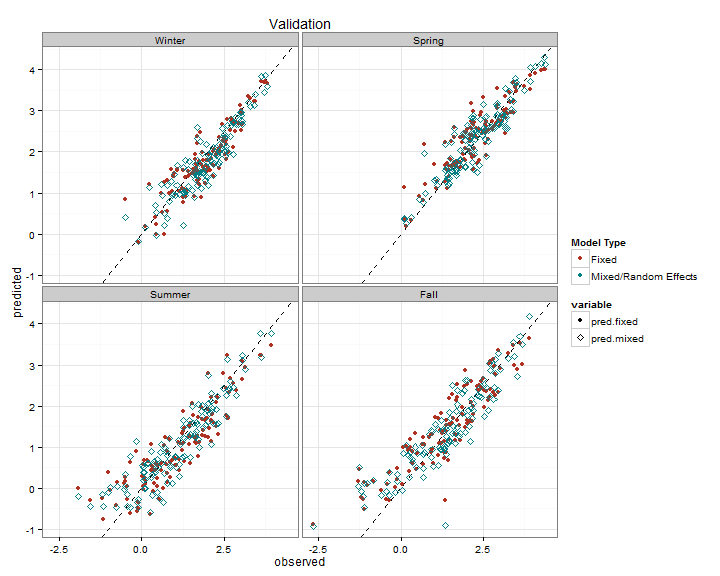
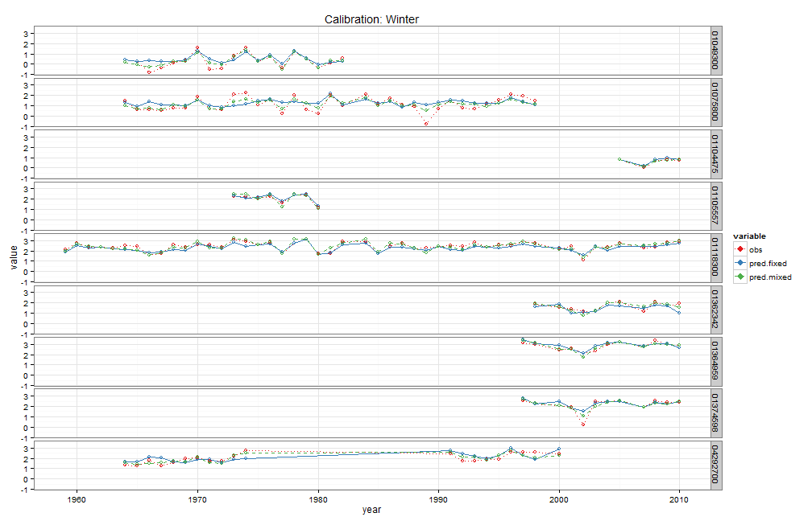
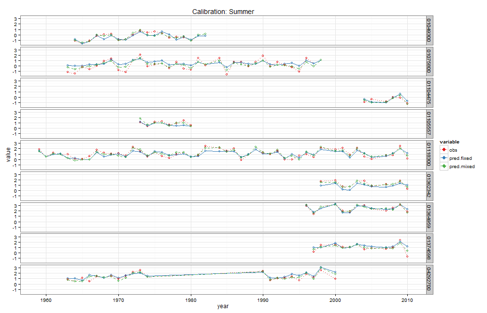

# Seasonal flow timeseries model<br> from paired flow and meterological/weather record
## 
## ALR July 2014<br>Conte Anadromous Fish Research Center
##   

### Load libraries, functions, etc

```r
library(lme4)
library(devtools)
library(knitr)
library(ggplot2)
library(plyr)

source_gist("https://gist.github.com/anarosner/ba285306fc0ce9d812a5", sha1="b25a1b73e02cc2b2d2c590f6c0b2c9c9945fa980")

model_data_dir<-"C:/ALR/Model_processed_data"
model_dir<-"C:/ALR/Models/CTRflows3/07-2014 met to flow"

setwd(model_dir)
setwd("../get_flow_data/daily_seasonal")  #hard coded directory name...change me
purl(input="0_general_functions.Rmd",output="0_general_functions.R",documentation=0)
source("0_general_functions.R")
file.remove("0_general_functions.R")

setwd(file.path(model_dir,"calib_data"))

opts_chunk$set(comment=NA)
```


### Load seasonal data, and look at number of records, sites, and years

```r
load(file=file.path(model_data_dir,"dseasonal.Rdata"))


dseasonal<-subset(dseasonal,!is.na(HydrologicGroupAB) & !is.na(flow) & !is.na(rain) & !is.na(precip.e.lag2))


# length(unique(dseasonal$site_no))
# #238 unique gages
# 
length(unique(dseasonal$site_no[dseasonal$large_barriers==0]))
```

```
[1] 120
```

```r
length(unique(dseasonal$site_no[dseasonal$TNC_DamCount==0]))
```

```
[1] 97
```

```r
length(unique(dseasonal$site_no[dseasonal$OnChannelWaterSqKM<.5]))
```

```
[1] 171
```

```r
length(unique(dseasonal$site_no[dseasonal$OnChannelWaterSqKM<.5 & dseasonal$large_barriers==0]))
```

```
[1] 110
```

```r
length(unique(dseasonal$site_no[dseasonal$OnChannelWaterSqKM<.5 & dseasonal$TNC_DamCount==0]))
```

```
[1] 89
```

```r
#120 with no LARGE barriers
#97 with no  barriers 

# 
# length(unique(dseasonal$year))
# min(dseasonal$year[!is.na(dseasonal$rain)] )
# max(dseasonal$year[!is.na(dseasonal$rain)] )
# # 62 unique years (records that have both flow and met data)
# #from 1949-2010
# 
nrow(dseasonal)
```

```
[1] 7870
```

```r
nrow(dseasonal[dseasonal$OnChannelWaterSqKM<.5,])
```

```
[1] 6226
```

```r
nrow(dseasonal[dseasonal$large_barriers==0,])
```

```
[1] 4140
```

```r
nrow(dseasonal[dseasonal$OnChannelWaterSqKM<.5 & dseasonal$large_barriers==0,])
```

```
[1] 3879
```

```r
nrow(dseasonal[dseasonal$TNC_DamCount==0,])
```

```
[1] 3283
```

```r
nrow(dseasonal[dseasonal$OnChannelWaterSqKM<.5 & dseasonal$TNC_DamCount==0,])
```

```
[1] 3114
```

```r
# 7870 total records
# 4140 records from sites w/ no LARGE barriers
# 3283 records from sites w/ no barriers

d.unreg<-subset(dseasonal,TNC_DamCount==0 & dseasonal$OnChannelWaterSqKM<.5)
```

### Create calibration and validation sets

```r
# View(d.unreg[,c(1:9,58,59,21:23)])

#choose validation set

                    #hold out 10 sites (approxinatekt 10% of unique sites) for calibration
set.seed(933550175)
val.gages<-sample(unique(d.unreg$site_no[d.unreg$qseasonal>12]),size=8,replace=F)
# val.gages<-sample(unique(d.unreg$site_no),size=10,replace=F)
val.gages
```

```
[1] "04288230" "01109200" "04276920" "01434105" "04292770" "04280300"
[7] "01096910" "01100568"
```

```r
                    #hold out 6 years (approxinatekt 10% of unique years) for calibration
                    
                    # plot(as.Date(dimnames(qseasonal)[[1]]),
                         #apply(qseasonal[,,2],MARGIN=1,FUN=function(x) sum(x>0,na.rm=T)))
                    #as years before ~1965 had many fewer sites than in other years, 
                         #choose years after that date
set.seed(993889335)
val.year<-sample(unique(d.unreg$year),5,replace=F)
val.year
```

```
[1] 1999 1956 2006 1954 1983
```

```r
# unique(d.unreg[d.unreg$site_no %in% val.gages,"year"])
# View(d.unreg[d.unreg$site_no %in% val.gages,])

nrow(d.unreg) #3283
```

```
[1] 3114
```

```r
nrow(d.unreg[d.unreg$qseasonal>10,])
```

```
[1] 2938
```

```r
nrow(subset(d.unreg,site_no %in% val.gages)) #266   196    208
```

```
[1] 291
```

```r
nrow(subset(d.unreg,year(as.Date(date)) %in% val.year)) #208   301
```

```
[1] 212
```

```r
nrow(subset(d.unreg, site_no %in% val.gages & year(as.Date(date)) %in% val.year )) #22  11   23
```

```
[1] 22
```

```r
d.calib<-subset(d.unreg,!(site_no %in% val.gages | year(as.Date(date)) %in% val.year))
nrow(d.calib) #2831   2890    2796
```

```
[1] 2633
```

```r
d.valid<-subset(d.unreg, site_no %in% val.gages | year(as.Date(date)) %in% val.year)
nrow(d.valid) #452   393     486
```

```
[1] 481
```

```r
nrow(d.valid)/nrow(d.unreg)*100 #13.76     11.97     approx 14% of total records
```

```
[1] 15.45
```

```r
# head(d.calib[,1:4])
# tail(d.calib[,1:4])

save(d.calib,d.valid,file="calib_valid.Rdata")
```

### Create mixed model

```r
m.fixed<-lm(log(flow) ~ 
               log(drain_area_va) +
               log(non.zero(DrainageClass)) + 
                    log(non.zero(PercentSandy))+
#                     log(non.zero(HydrologicGroupAB))+ log(non.zero(SurficialCoarseC)) + 
               log(non.zero(Forest)) + 
               log(non.zero(Agriculture)) +     
#                     log(non.zero(Impervious))+
               log(non.zero(OffChannelWaterSqKM)) + 
#                     log(non.zero(OffChannelWetlandSqKM))+
#                     log(non.zero(OffChannelWaterSqKM+OffChannelWetlandSqKM)) + 
#                log(non.zero(BasinSlopePCNT))+ 
                    log(non.zero(ReachSlopePCNT)) +
               precip.e +  precip.e.lag1 + 
               precip.e.lag2 +
               1,
          na.action=NULL, #to ensure we attached fitted values w/ correct site_no
         data=d.calib) 

#create model for each season
season.names<-c("winter","spring","summer","fall")
m.fixed.season<-list()
# for (i in season.names) {
#      temp<-update(m.fixed, subset=season==i)
#      m.fixed.season[[i]]<-temp
# }

m.fixed.season[["winter"]]<-update(m.fixed, subset=season=="winter")
m.fixed.season$winter<-update(m.fixed.season$winter,formula=.~.
                              -log(non.zero(DrainageClass))
                              -log(non.zero(PercentSandy)) )


m.fixed.season[["spring"]]<-update(m.fixed, subset=season=="spring")
m.fixed.season$spring<-update(m.fixed.season$spring,formula=.~.
                              -log(non.zero(DrainageClass))
                              -log(non.zero(ReachSlopePCNT))
                              )
                              

m.fixed.season[["summer"]]<-update(m.fixed, subset=season=="summer")
m.fixed.season$summer<-update(m.fixed.season$summer,formula=.~.
                              - log(non.zero(PercentSandy)) 
#                               -log(non.zero(ReachSlopePCNT)) 
                              -log(non.zero(OffChannelWaterSqKM)) 
                              +log(non.zero(Impervious))
                              -log(non.zero(Forest))
                              )


m.fixed.season[["fall"]]<-update(m.fixed, subset=season=="fall")
m.fixed.season$fall<-update(m.fixed.season$fall,formula=.~.
                            -log(non.zero(DrainageClass))
                            -log(non.zero(ReachSlopePCNT))   
                            )

rm(m.fixed)


# summaries of fixed models
for (i in season.names) {
     print(paste("#####",i,"#####"))
     print(summary(m.fixed.season[[i]]))
}
```

```
[1] "##### winter #####"

Call:
lm(formula = log(flow) ~ log(drain_area_va) + log(non.zero(Forest)) + 
    log(non.zero(Agriculture)) + log(non.zero(OffChannelWaterSqKM)) + 
    log(non.zero(ReachSlopePCNT)) + precip.e + precip.e.lag1 + 
    precip.e.lag2, data = d.calib, subset = season == "winter", 
    na.action = NULL)

Residuals:
    Min      1Q  Median      3Q     Max 
-1.8701 -0.2043  0.0158  0.2545  2.2518 

Coefficients:
                                    Estimate Std. Error t value Pr(>|t|)
(Intercept)                        -1.405043   0.250009   -5.62  2.8e-08
log(drain_area_va)                  0.981272   0.020867   47.03  < 2e-16
log(non.zero(Forest))               0.116290   0.054511    2.13    0.033
log(non.zero(Agriculture))         -0.018824   0.004065   -4.63  4.4e-06
log(non.zero(OffChannelWaterSqKM))  0.010170   0.005964    1.71    0.089
log(non.zero(ReachSlopePCNT))       0.055012   0.026613    2.07    0.039
precip.e                            0.003712   0.000165   22.46  < 2e-16
precip.e.lag1                       0.001510   0.000181    8.36  3.8e-16
precip.e.lag2                       0.000860   0.000166    5.17  3.0e-07
                                      
(Intercept)                        ***
log(drain_area_va)                 ***
log(non.zero(Forest))              *  
log(non.zero(Agriculture))         ***
log(non.zero(OffChannelWaterSqKM)) .  
log(non.zero(ReachSlopePCNT))      *  
precip.e                           ***
precip.e.lag1                      ***
precip.e.lag2                      ***
---
Signif. codes:  0 '***' 0.001 '**' 0.01 '*' 0.05 '.' 0.1 ' ' 1

Residual standard error: 0.422 on 656 degrees of freedom
Multiple R-squared:  0.829,	Adjusted R-squared:  0.827 
F-statistic:  398 on 8 and 656 DF,  p-value: <2e-16

[1] "##### spring #####"

Call:
lm(formula = log(flow) ~ log(drain_area_va) + log(non.zero(PercentSandy)) + 
    log(non.zero(Forest)) + log(non.zero(Agriculture)) + log(non.zero(OffChannelWaterSqKM)) + 
    precip.e + precip.e.lag1 + precip.e.lag2, data = d.calib, 
    subset = season == "spring", na.action = NULL)

Residuals:
    Min      1Q  Median      3Q     Max 
-1.4197 -0.1861  0.0244  0.2004  1.7249 

Coefficients:
                                    Estimate Std. Error t value Pr(>|t|)
(Intercept)                        -9.18e-01   1.29e-01   -7.14  2.5e-12
log(drain_area_va)                  9.62e-01   1.55e-02   62.15  < 2e-16
log(non.zero(PercentSandy))        -6.89e-03   2.07e-03   -3.33  0.00091
log(non.zero(Forest))               2.92e-01   2.68e-02   10.92  < 2e-16
log(non.zero(Agriculture))         -1.17e-02   3.26e-03   -3.59  0.00035
log(non.zero(OffChannelWaterSqKM)) -7.03e-03   4.16e-03   -1.69  0.09152
precip.e                            1.71e-03   1.04e-04   16.36  < 2e-16
precip.e.lag1                       9.71e-04   1.29e-04    7.51  2.0e-13
precip.e.lag2                      -4.15e-05   1.35e-04   -0.31  0.75805
                                      
(Intercept)                        ***
log(drain_area_va)                 ***
log(non.zero(PercentSandy))        ***
log(non.zero(Forest))              ***
log(non.zero(Agriculture))         ***
log(non.zero(OffChannelWaterSqKM)) .  
precip.e                           ***
precip.e.lag1                      ***
precip.e.lag2                         
---
Signif. codes:  0 '***' 0.001 '**' 0.01 '*' 0.05 '.' 0.1 ' ' 1

Residual standard error: 0.319 on 661 degrees of freedom
Multiple R-squared:  0.879,	Adjusted R-squared:  0.878 
F-statistic:  601 on 8 and 661 DF,  p-value: <2e-16

[1] "##### summer #####"

Call:
lm(formula = log(flow) ~ log(drain_area_va) + log(non.zero(DrainageClass)) + 
    log(non.zero(Agriculture)) + log(non.zero(ReachSlopePCNT)) + 
    precip.e + precip.e.lag1 + precip.e.lag2 + log(non.zero(Impervious)), 
    data = d.calib, subset = season == "summer", na.action = NULL)

Residuals:
    Min      1Q  Median      3Q     Max 
-2.1114 -0.3609  0.0369  0.3960  1.7256 

Coefficients:
                               Estimate Std. Error t value Pr(>|t|)    
(Intercept)                   -1.389729   0.197245   -7.05  4.7e-12 ***
log(drain_area_va)             0.914412   0.028291   32.32  < 2e-16 ***
log(non.zero(DrainageClass))  -0.762724   0.124733   -6.11  1.7e-09 ***
log(non.zero(Agriculture))    -0.049636   0.006369   -7.79  2.6e-14 ***
log(non.zero(ReachSlopePCNT)) -0.030072   0.024396   -1.23   0.2182    
precip.e                       0.004722   0.000242   19.48  < 2e-16 ***
precip.e.lag1                  0.000777   0.000194    4.01  6.8e-05 ***
precip.e.lag2                  0.001408   0.000226    6.22  9.1e-10 ***
log(non.zero(Impervious))      0.030330   0.010989    2.76   0.0059 ** 
---
Signif. codes:  0 '***' 0.001 '**' 0.01 '*' 0.05 '.' 0.1 ' ' 1

Residual standard error: 0.578 on 649 degrees of freedom
Multiple R-squared:  0.739,	Adjusted R-squared:  0.736 
F-statistic:  229 on 8 and 649 DF,  p-value: <2e-16

[1] "##### fall #####"

Call:
lm(formula = log(flow) ~ log(drain_area_va) + log(non.zero(PercentSandy)) + 
    log(non.zero(Forest)) + log(non.zero(Agriculture)) + log(non.zero(OffChannelWaterSqKM)) + 
    precip.e + precip.e.lag1 + precip.e.lag2, data = d.calib, 
    subset = season == "fall", na.action = NULL)

Residuals:
   Min     1Q Median     3Q    Max 
-3.277 -0.260  0.035  0.343  2.246 

Coefficients:
                                    Estimate Std. Error t value Pr(>|t|)
(Intercept)                        -2.698173   0.207291  -13.02  < 2e-16
log(drain_area_va)                  0.944530   0.028311   33.36  < 2e-16
log(non.zero(PercentSandy))         0.013230   0.003700    3.58  0.00038
log(non.zero(Forest))               0.097725   0.046047    2.12  0.03420
log(non.zero(Agriculture))         -0.047322   0.005795   -8.17  1.7e-15
log(non.zero(OffChannelWaterSqKM)) -0.019636   0.006953   -2.82  0.00489
precip.e                            0.005510   0.000217   25.37  < 2e-16
precip.e.lag1                       0.002103   0.000231    9.10  < 2e-16
precip.e.lag2                      -0.000297   0.000176   -1.69  0.09097
                                      
(Intercept)                        ***
log(drain_area_va)                 ***
log(non.zero(PercentSandy))        ***
log(non.zero(Forest))              *  
log(non.zero(Agriculture))         ***
log(non.zero(OffChannelWaterSqKM)) ** 
precip.e                           ***
precip.e.lag1                      ***
precip.e.lag2                      .  
---
Signif. codes:  0 '***' 0.001 '**' 0.01 '*' 0.05 '.' 0.1 ' ' 1

Residual standard error: 0.543 on 631 degrees of freedom
Multiple R-squared:  0.786,	Adjusted R-squared:  0.783 
F-statistic:  290 on 8 and 631 DF,  p-value: <2e-16
```

```r
# # all DID...have adj-r-sqr around 0.8976 with old calibration set, but that set was too small....
i<-"winter" #0.8296     0.8321 v 0.8249
i<-"spring" #0.8823     0.8929 v .8697
i<-"summer" #0.7246     0.7553 v 0.715
i<-"fall" #0.7827       0.7985 v 0.7827
```


### Create mixed model: random effects for year and site

```r
m.mixed<-lmer(log(flow) ~ 
               log(drain_area_va) +
#                log(non.zero(DrainageClass)) + 
               log(non.zero(PercentSandy))+
#                     log(non.zero(HydrologicGroupAB))+ log(non.zero(SurficialCoarseC)) + 
               log(non.zero(Forest)) + 
               log(non.zero(Agriculture)) +     
#                     log(non.zero(Impervious))+
               log(non.zero(OffChannelWaterSqKM)) + 
#                     log(non.zero(OffChannelWetlandSqKM))+
#                     log(non.zero(OffChannelWaterSqKM+OffChannelWetlandSqKM)) + 
#                log(non.zero(BasinSlopePCNT))+ 
               log(non.zero(ReachSlopePCNT)) +
               precip.e +  precip.e.lag1 + 
               precip.e.lag2 +
               (1|date)+(1|site_no),
          na.action=NULL, #to ensure we attached fitted values w/ correct site_no
          data=d.calib)

m.mixed.season<-list()
for (i in 1:length(season.names)) {
     temp<-update(m.mixed, subset=season==season.names[i])
     m.mixed.season[[season.names[i]]]<-temp
     print(paste("#####",season.names[i],"#####"))
#      print(summary(temp))
     print(AIC(temp))
}
```

```
[1] "##### winter #####"
[1] 570.3
[1] "##### spring #####"
[1] -57.07
[1] "##### summer #####"
[1] 905.6
[1] "##### fall #####"
[1] 957.1
```

```r
rm(m.mixed)


#      
#                log(non.zero(DrainageClass)) + 
#                     #log(non.zero(PercentSandy))+
#                     #log(non.zero(HydrologicGroupAB))+ log(non.zero(SurficialCoarseC)) + 
#                log(non.zero(Forest)) + 
#                log(non.zero(Agriculture)) +     
#                     #log(non.zero(Impervious))+
#                log(non.zero(OffChannelWaterSqKM)) + 
#                     #log(non.zero(OffChannelWetlandSqKM))+
#                     #log(non.zero(OffChannelWaterSqKM+OffChannelWetlandSqKM)) + 
#                log(non.zero(BasinSlopePCNT))+ 
#                     #log(non.zero(ReachSlopePCNT)) +
#                precip.e +  precip.e.lag1 + 
#                precip.e.lag2 +
```

### Calculate goodness of fit for calibration data set

```r
pred.calib<-d.calib
pred.calib$obs<-log(pred.calib$flow)
pred.calib$pred.fixed<-NA
pred.calib$pred.mixed<-NA

rm(goodness.fixed.calib,goodness.mixed.calib)
for (i in season.names) {
     pred.calib[pred.calib$season==i,"pred.fixed"]<-
          predict(m.fixed.season[[i]],
                  newdata=pred.calib[pred.calib$season==i,])
     pred.calib[pred.calib$season==i,"pred.mixed"]<-
          predict(m.mixed.season[[i]],
                  newdata=pred.calib[pred.calib$season==i,],
                  allow.new.levels=T)
#      boo<-pred.calib[pred.calib$season==i,c("obs","pred.fixed")]
#      goodness(boo)
     temp<-goodness(
               pred.calib[pred.calib$season==i,c("obs","pred.fixed")]
               )
     if(!exists("goodness.fixed.calib")){
          goodness.fixed.calib<-temp
          goodness.fixed.calib$season<-i
          goodness.fixed.calib<-goodness.fixed.calib[,c(ncol(goodness.fixed.calib),1:(ncol(goodness.fixed.calib)-1))]
     }
     else
          goodness.fixed.calib[nrow(goodness.fixed.calib)+1,]<-c(i,temp)
     
     temp<-goodness(
               pred.calib[pred.calib$season==i,c("obs","pred.mixed")]
               )
     if(!exists("goodness.mixed.calib")){
          goodness.mixed.calib<-temp     
          goodness.mixed.calib$season<-i
          goodness.mixed.calib<-goodness.mixed.calib[,c(ncol(goodness.mixed.calib),1:(ncol(goodness.mixed.calib)-1))]
     }
     else
          goodness.mixed.calib[nrow(goodness.mixed.calib)+1,]<-c(i,temp)
}
```

### Calculate goodness of fit for validation data set

```r
pred.valid<-d.valid
pred.valid$obs<-log(pred.valid$flow)
pred.valid$pred.fixed<-NA
pred.valid$pred.mixed<-NA

rm(goodness.fixed.valid,goodness.mixed.valid)
for (i in season.names) {
     pred.valid[pred.valid$season==i,"pred.fixed"]<-
          predict(m.fixed.season[[i]],
                  newdata=pred.valid[pred.valid$season==i,])
     pred.valid[pred.valid$season==i,"pred.mixed"]<-
          predict(m.mixed.season[[i]],
                  newdata=pred.valid[pred.valid$season==i,],
                  allow.new.levels=T)
#      boo<-pred.calib[pred.calib$season==i,c("obs","pred.fixed")]
#      goodness(boo)
     temp<-goodness(
               pred.valid[pred.valid$season==i,c("obs","pred.fixed")]
               )
     if(!exists("goodness.fixed.valid")){
          goodness.fixed.valid<-temp
          goodness.fixed.valid$season<-i
          goodness.fixed.valid<-goodness.fixed.valid[,c(ncol(goodness.fixed.valid),1:(ncol(goodness.fixed.valid)-1))]
     }
     else
          goodness.fixed.valid[nrow(goodness.fixed.valid)+1,]<-c(i,temp)
     
     temp<-goodness(
               pred.valid[pred.valid$season==i,c("obs","pred.mixed")]
               )
     if(!exists("goodness.mixed.valid")){
          goodness.mixed.valid<-temp     
          goodness.mixed.valid$season<-i
          goodness.mixed.valid<-goodness.mixed.valid[,c(ncol(goodness.mixed.valid),1:(ncol(goodness.mixed.valid)-1))]
     }
     else
          goodness.mixed.valid[nrow(goodness.mixed.valid)+1,]<-c(i,temp)
}
```

### Goodness of fit statistics

```r
goodness.fixed.calib
```

```
  season sample.n  mean  RMSE NSEff bias percent.bias pearsonR CV.error
1 winter      665 2.001 0.296 0.829    0            0    0.911    0.209
2 spring      670 2.608 0.224 0.879    0            0    0.938    0.122
3 summer      658 1.141 0.406 0.739    0            0    0.860    0.503
4   fall      640 1.469 0.382 0.786    0            0    0.887    0.368
```

```r
goodness.mixed.calib
```

```
  season sample.n  mean  RMSE NSEff bias percent.bias pearsonR CV.error
1 winter      665 2.001 0.183 0.934    0            0    0.967    0.130
2 spring      670 2.608 0.110 0.971    0            0    0.985    0.060
3 summer      658 1.141 0.235 0.912    0            0    0.955    0.292
4   fall      640 1.469 0.260 0.901    0            0    0.949    0.250
```

```r
goodness.fixed.valid
```

```
  season sample.n  mean  RMSE NSEff   bias percent.bias pearsonR CV.error
1 winter      120 1.922 0.253 0.824 -0.087       -4.510    0.914    0.181
2 spring      122 2.279 0.269 0.818  0.070        3.058    0.908    0.165
3 summer      121 1.086 0.400 0.759  0.079        7.293    0.876    0.518
4   fall      118 1.370 0.405 0.792  0.172       12.544    0.908    0.401
```

```r
goodness.mixed.valid
```

```
  season sample.n  mean  RMSE NSEff   bias percent.bias pearsonR CV.error
1 winter      120 1.922 0.267 0.804 -0.138       -7.191    0.913    0.183
2 spring      122 2.279 0.254 0.838  0.029        1.276    0.916    0.158
3 summer      121 1.086 0.341 0.825 -0.022       -1.986    0.910    0.446
4   fall      118 1.370 0.391 0.807  0.086        6.255    0.905    0.400
```

### Melt data frames for ggplot

```r
#create melted data frames for ggplot

#for correlation plots
dd.corr.calib<-melt(
     pred.calib[,c("site_no","season","year","obs","pred.fixed","pred.mixed")],
     id.vars=c("site_no","season","year","obs"))
dd.corr.calib$season<-factor(capitalize(dd.corr.calib$season),levels=c("Winter","Spring","Summer","Fall"))
dd.corr.valid<-melt(
     pred.valid[,c("site_no","season","year","obs","pred.fixed","pred.mixed")],
     id.vars=c("site_no","season","year","obs"))
dd.corr.valid$season<-factor(capitalize(dd.corr.valid$season),levels=c("Winter","Spring","Summer","Fall"))


#for hydrographs and other plots
dd.calib<-pred.calib[,c("site_no","FEATUREID","date","year","season","qseasonal","da_sqkm",
          "OnChannelWaterSqKM","OnChannelWetlandSqKM","large_barriers","small_barriers",
          "precip.e","precip.e.lag1","precip.e.lag2","flow",
          "obs","pred.fixed","pred.mixed" )]
dd.calib<-melt(dd.calib,id.vars=c("site_no","FEATUREID","date","year","season",
                                  "qseasonal","da_sqkm","OnChannelWaterSqKM",
                                  "OnChannelWetlandSqKM","large_barriers","small_barriers"))

dd.valid<-pred.valid[,c("site_no","FEATUREID","date","year","season","qseasonal","da_sqkm",
          "OnChannelWaterSqKM","OnChannelWetlandSqKM","large_barriers","small_barriers",
          "precip.e","precip.e.lag1","precip.e.lag2","flow",
          "obs","pred.fixed","pred.mixed" )]
dd.valid<-melt(dd.valid,id.vars=c("site_no","FEATUREID","date","year","season",
                                  "qseasonal","da_sqkm","OnChannelWaterSqKM",
                                  "OnChannelWetlandSqKM","large_barriers","small_barriers"))
```

###View correlation of observed vs predicted values

```r
gg.corr<- ggplot(dd.corr.calib,
               aes(x=obs,y=value,colour=variable))+ 
          geom_abline(a=1,b=0,col="black",lty=2)+     
          theme_bw()+xlab("observed")+ylab("predicted")+
          #scale_colour_hue(l=40) 
          scale_colour_hue(l=40, 
               name="Model Type",
               breaks=c("pred.fixed", "pred.mixed"),
               labels=c("Fixed", "Mixed/Random Effects"))
gg.corr + geom_point() + facet_wrap(~season) + ggtitle("Calibration")
```

 

```r
gg.corr %+% dd.corr.valid + geom_point() + facet_wrap(~season) + ggtitle("Validation")
```

 

### View hydrograph of <i>sample</i> sites from calibration set, and all validation sites 

```r
gg.hydrograph<-ggplot(data=subset(dd.valid,
                             variable %in% c("obs","pred.fixed","pred.mixed") & site_no %in% val.gages),
                      aes(x=year,y=value,colour=variable)) +
     theme_bw()+scale_colour_brewer(type="qual",palette="Set1")

#pull sample sites from calibration set
set.seed(94802834)
sample.calib<-sample(x=dd.calib[dd.calib$qseasonal>=20,"site_no"],size=10,replace=F)
#calibration hydrographs
for (i in season.names) {
     print(
     gg.hydrograph %+% subset(dd.calib,site_no %in% sample.calib & variable %in% c("obs","pred.fixed","pred.mixed"))+
          geom_line(subset=.(season==i)) +
          geom_point(subset=.(season==i),cex=2,pch=1)+
          geom_point(subset=.(season==i & year %in% val.year),cex=4,pch=18)+
          facet_grid(site_no~.)+
          ggtitle(paste("Calibration:",capitalize(i)))
     )
}
```

    

```r
#validation hydrographs
for (i in season.names) {
     print(
     gg.hydrograph + 
          geom_line(subset=.(season==i)) +
          geom_point(subset=.(season==i),cex=2,pch=1)+
          geom_point(subset=.(season==i & year %in% val.year),cex=4,pch=18)+
          facet_grid(site_no~.)+
          ggtitle(paste("Validation:",capitalize(i)))
     )
}
```

    

### Trial of plots for validating by year 

```r
gg.error<-ggplot(data=dd.valid,
                 aes(x=site_no,y=value,col=variable)) +
     geom_boxplot(fill="grey30",col="grey30")+geom_point(pch=15,cex=3)+
     scale_colour_brewer(type="qual",palette="Set1")+
     facet_grid(season~year, scales="free_x", space="free_x")


#create sample of years from calibration data set
set.seed(96536573)
sample.calib.year<-sample(x=dd.calib[,"year"],size=10,replace=F)
#calibration plot
gg.error %+% subset(dd.calib, variable %in% c("obs","pred.mixed") & year %in% sample.calib.year )+ ggtitle("Calibration")
```

 

```r
#validation plot
gg.error %+% subset(dd.valid, variable %in% c("obs","pred.mixed") & year %in% val.year )+ ggtitle("Validation")
```

 

```r
# 
# for (i in season.names)
#      print(
#           gg.error %+% subset(dd.valid, variable %in% c("obs","pred.mixed") & year %in% val.year & season==i )+ ggtitle(paste("Validation:",capitalize(i)))
#      )
# 
# for (i in season.names)
#      print(
#           gg.error %+% subset(dd.calib, variable %in% c("obs","pred.mixed") & year %in% sample.calib.year & season==i )+ ggtitle(paste("Calibration:",capitalize(i)))
# )
```


