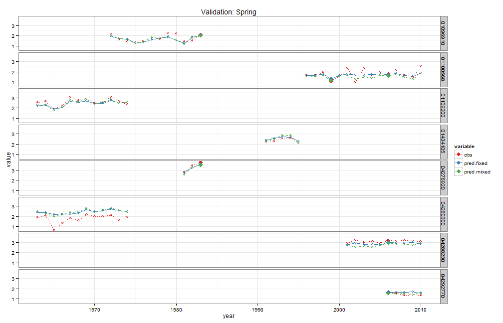
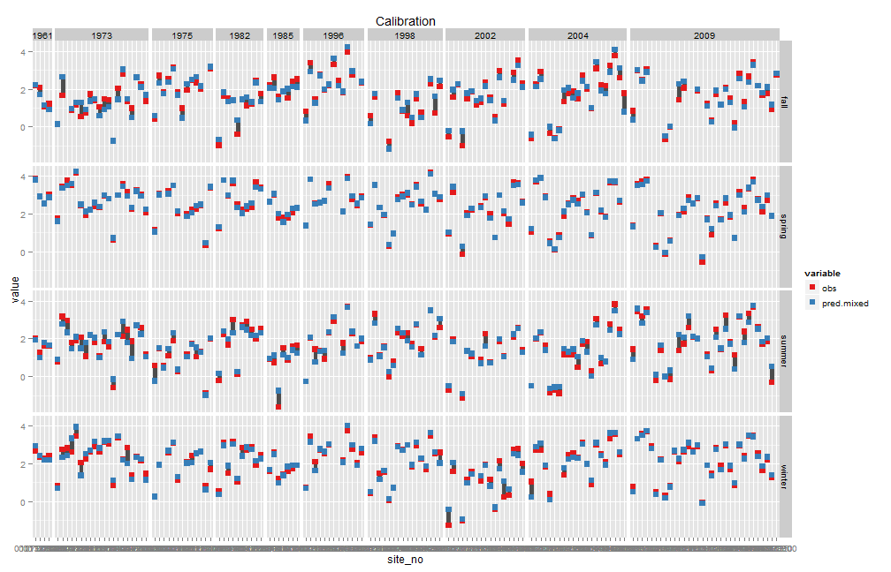

# Seasonal flow timeseries model<br> from paired flow and meterological/weather record
## 
## ALR July 2014<br>Conte Anadromous Fish Research Center
##   

### Load libraries, functions, etc

```r
library(lme4)
library(devtools)
library(knitr)
library(ggplot2)
library(plyr)

opts_chunk$set(comment=NA)
```


```r
#utility functions, load (source) from my saved gist
source_gist("https://gist.github.com/anarosner/ba285306fc0ce9d812a5", sha1="b25a1b73e02cc2b2d2c590f6c0b2c9c9945fa980")

model_dir<-"C:/ALR/Models/MetToFlow"
model_data_dir<-"C:/ALR/Models_processed_data"

#load (source) this project's general functions
setwd(file.path(model_dir,"A_get_data"))  
purl(input="0_general_functions.Rmd",output="0_general_functions.R",documentation=0)
source("0_general_functions.R")
file.remove("0_general_functions.R")

season.names<-c("winter","spring","summer","fall")
```


### Load seasonal data, and look at number of records, sites, and years

```r
load(file=file.path(model_data_dir,"flow_timeseries","dseasonal.Rdata"))


dseasonal<-subset(dseasonal,!is.na(HydrologicGroupAB) & !is.na(flow) & !is.na(rain) & !is.na(precip.e.lag2))


# length(unique(dseasonal$site_no))
# #238 unique gages
# 
length(unique(dseasonal$site_no[dseasonal$large_barriers==0]))
```

```
[1] 120
```

```r
length(unique(dseasonal$site_no[dseasonal$TNC_DamCount==0]))
```

```
[1] 97
```

```r
length(unique(dseasonal$site_no[dseasonal$OnChannelWaterSqKM<.5]))
```

```
[1] 171
```

```r
length(unique(dseasonal$site_no[dseasonal$OnChannelWaterSqKM<.5 & dseasonal$large_barriers==0]))
```

```
[1] 110
```

```r
length(unique(dseasonal$site_no[dseasonal$OnChannelWaterSqKM<.5 & dseasonal$TNC_DamCount==0]))
```

```
[1] 89
```

```r
#120 with no LARGE barriers
#97 with no  barriers 


# 7870 total records
nrow(dseasonal)
```

```
[1] 7870
```

```r
# 4140 records from sites w/ no LARGE barriers
nrow(dseasonal[dseasonal$large_barriers==0,])
```

```
[1] 4140
```

```r
nrow(dseasonal[dseasonal$OnChannelWaterSqKM<.5,])
```

```
[1] 6226
```

```r
# 3879 records from sites w/ no LARGE barriers and <.5 sq km impoundments
nrow(dseasonal[dseasonal$OnChannelWaterSqKM<.5 & dseasonal$large_barriers==0,])
```

```
[1] 3879
```

```r
# 3283 records from sites w/ no barriers
nrow(dseasonal[dseasonal$TNC_DamCount==0,])
```

```
[1] 3283
```

```r
# 3114 records from sites w/ no barriers and <.5 sq km impoundments
nrow(dseasonal[dseasonal$OnChannelWaterSqKM<.5 & dseasonal$TNC_DamCount==0,])
```

```
[1] 3114
```

```r
#subset of unregulated gages
#   defined as NO dams from TNC barrier inventory
#   AND upstream on-channel open waterbodies < 0.5 sq km
d.unreg<-subset(dseasonal,TNC_DamCount==0 & dseasonal$OnChannelWaterSqKM<.5)
```

### Create calibration and validation sets

```r
# View(d.unreg[,c(1:9,58,59,21:23)])

#choose validation set
#select some gages to leave out for validations
#    AND select some years, leave out records from all gages for those year for validation
#    so that combined validation set #records is 10-15% of total records


#choose 8 sites w/ more than 4 yrs records
set.seed(933550175)
val.gages<-sample(unique(d.unreg$site_no[d.unreg$qseasonal>12]),size=8,replace=F)  
# val.gages

#choose 5 years
set.seed(993889335)
val.year<-sample(unique(d.unreg$year),5,replace=F)
sort(val.year)
```

```
[1] 1954 1956 1983 1999 2006
```

```r
#check number of records chosen as part of validation gages and validation years
nrow(d.unreg) #3114
```

```
[1] 3114
```

```r
nrow(d.unreg[d.unreg$qseasonal>12,]) #2870
```

```
[1] 2870
```

```r
nrow(subset(d.unreg,site_no %in% val.gages)) #291
```

```
[1] 291
```

```r
nrow(subset(d.unreg,year(as.Date(date)) %in% val.year)) #212
```

```
[1] 212
```

```r
nrow(subset(d.unreg, site_no %in% val.gages & year(as.Date(date)) %in% val.year )) #22
```

```
[1] 22
```

```r
#subset and count size of calib and valid data sets
d.calib<-subset(d.unreg,!(site_no %in% val.gages | year(as.Date(date)) %in% val.year))
nrow(d.calib) #2633
```

```
[1] 2633
```

```r
d.valid<-subset(d.unreg, site_no %in% val.gages | year(as.Date(date)) %in% val.year)
nrow(d.valid) #481   
```

```
[1] 481
```

```r
nrow(d.valid)/nrow(d.unreg)*100 #15.44637    approx 15% of total records
```

```
[1] 15.45
```

```r
#save calibration and validation data
setwd(file.path(model_dir,"c_seasonal_means/calib_data"))
save(d.calib,d.valid,file="calib_valid.Rdata")
```

### Create mixed model

```r
m.fixed<-lm(log(flow) ~ 
               log(drain_area_va) +
               log(non.zero(DrainageClass)) + 
                    log(non.zero(PercentSandy))+
#                     log(non.zero(HydrologicGroupAB))+ log(non.zero(SurficialCoarseC)) + 
               log(non.zero(Forest)) + 
               log(non.zero(Agriculture)) +     
#                     log(non.zero(Impervious))+
               log(non.zero(OffChannelWaterSqKM)) + 
#                     log(non.zero(OffChannelWetlandSqKM))+
#                     log(non.zero(OffChannelWaterSqKM+OffChannelWetlandSqKM)) + 
#                log(non.zero(BasinSlopePCNT))+ 
                    log(non.zero(ReachSlopePCNT)) +               
               log(non.zero(precip.e)) +  log(non.zero(precip.e.lag1)) + 
#                ((precip.e)) +  ((precip.e.lag1)) + 
#                log(non.zero(precip.e.lag2)) +
               1,
          na.action=NULL, #to ensure we attached fitted values w/ correct site_no
         data=d.calib) 

#create model for each season
m.fixed.season<-list()
# looping didn't work!  model would change when called later on depending on *current* value of i... oh dear

m.fixed.season[["winter"]]<-update(m.fixed, subset=season=="winter")
m.fixed.season$winter<-update(m.fixed.season$winter,formula=.~.
                              -log(non.zero(DrainageClass))
                              -log(non.zero(PercentSandy))
                              +log(non.zero(Impervious))
                              -log(non.zero(Forest))
                              -log(non.zero(precip.e)) -log(non.zero(precip.e.lag1))  
                              +precip.e +  precip.e.lag1 
#                               -log(non.zero(ReachSlopePCNT))
#                               + log(AnnualTminC+20)+ log(non.zero(frozen))+frozen+log(non.zero(gdd)) +gdd
                              )


m.fixed.season[["spring"]]<-update(m.fixed, subset=season=="spring")
m.fixed.season$spring<-update(m.fixed.season$spring,formula=.~.
                              -log(non.zero(DrainageClass))
                              -log(non.zero(OffChannelWaterSqKM))
#                               -log(non.zero(ReachSlopePCNT))
#                               +gdd
                              +log(non.zero(gdd))
                              +log(pet)
                              )
                              

m.fixed.season[["summer"]]<-update(m.fixed, subset=season=="summer")
m.fixed.season$summer<-update(m.fixed.season$summer,formula=.~.
                              +log(non.zero(precip.e.lag2))
                              - log(non.zero(PercentSandy)) 
                              -log(non.zero(OffChannelWaterSqKM)) 
                              +log(non.zero(gdd))
                              +log(pet)
#                               -log(non.zero(ReachSlopePCNT))  +log(non.zero(Impervious))-log(non.zero(Forest))
                              )


m.fixed.season[["fall"]]<-update(m.fixed, subset=season=="fall")
m.fixed.season$fall<-update(m.fixed.season$fall,formula=.~.
                            -log(non.zero(DrainageClass))
                            -log(non.zero(ReachSlopePCNT))  
                              +log(non.zero(gdd))
                              +log(pet) 
                            )

rm(m.fixed)


# summaries of fixed models
for (i in season.names) {
     print(paste("#####",i,"#####"))
     print(summary(m.fixed.season[[i]]))
     vif(m.fixed.season[[i]])
}
```

```
[1] "##### winter #####"

Call:
lm(formula = log(flow) ~ log(drain_area_va) + log(non.zero(Agriculture)) + 
    log(non.zero(OffChannelWaterSqKM)) + log(non.zero(ReachSlopePCNT)) + 
    log(non.zero(Impervious)) + precip.e + precip.e.lag1, data = d.calib, 
    subset = season == "winter", na.action = NULL)

Residuals:
    Min      1Q  Median      3Q     Max 
-1.8802 -0.1965  0.0269  0.2421  2.1654 

Coefficients:
                                    Estimate Std. Error t value Pr(>|t|)
(Intercept)                        -0.591345   0.093548   -6.32  4.8e-10
log(drain_area_va)                  0.971027   0.021614   44.93  < 2e-16
log(non.zero(Agriculture))         -0.012747   0.004758   -2.68  0.00757
log(non.zero(OffChannelWaterSqKM))  0.020969   0.006269    3.35  0.00087
log(non.zero(ReachSlopePCNT))       0.075527   0.018521    4.08  5.1e-05
log(non.zero(Impervious))          -0.026342   0.008213   -3.21  0.00140
precip.e                            0.003552   0.000164   21.64  < 2e-16
precip.e.lag1                       0.001649   0.000180    9.16  < 2e-16
                                      
(Intercept)                        ***
log(drain_area_va)                 ***
log(non.zero(Agriculture))         ** 
log(non.zero(OffChannelWaterSqKM)) ***
log(non.zero(ReachSlopePCNT))      ***
log(non.zero(Impervious))          ** 
precip.e                           ***
precip.e.lag1                      ***
---
Signif. codes:  0 '***' 0.001 '**' 0.01 '*' 0.05 '.' 0.1 ' ' 1

Residual standard error: 0.427 on 657 degrees of freedom
Multiple R-squared:  0.824,	Adjusted R-squared:  0.822 
F-statistic:  440 on 7 and 657 DF,  p-value: <2e-16

[1] "##### spring #####"

Call:
lm(formula = log(flow) ~ log(drain_area_va) + log(non.zero(PercentSandy)) + 
    log(non.zero(Forest)) + log(non.zero(Agriculture)) + log(non.zero(ReachSlopePCNT)) + 
    log(non.zero(precip.e)) + log(non.zero(precip.e.lag1)) + 
    log(non.zero(gdd)) + log(pet), data = d.calib, subset = season == 
    "spring", na.action = NULL)

Residuals:
    Min      1Q  Median      3Q     Max 
-1.4318 -0.1673  0.0308  0.1936  1.5957 

Coefficients:
                              Estimate Std. Error t value Pr(>|t|)    
(Intercept)                   -6.24571    0.53736  -11.62  < 2e-16 ***
log(drain_area_va)             0.95985    0.01490   64.42  < 2e-16 ***
log(non.zero(PercentSandy))   -0.00639    0.00200   -3.19  0.00147 ** 
log(non.zero(Forest))          0.25214    0.04075    6.19  1.1e-09 ***
log(non.zero(Agriculture))    -0.01123    0.00299   -3.75  0.00019 ***
log(non.zero(ReachSlopePCNT))  0.03012    0.01756    1.72  0.08680 .  
log(non.zero(precip.e))        0.66673    0.03923   17.00  < 2e-16 ***
log(non.zero(precip.e.lag1))   0.11878    0.01866    6.37  3.6e-10 ***
log(non.zero(gdd))             0.13374    0.03008    4.45  1.0e-05 ***
log(pet)                      -0.96215    0.24985   -3.85  0.00013 ***
---
Signif. codes:  0 '***' 0.001 '**' 0.01 '*' 0.05 '.' 0.1 ' ' 1

Residual standard error: 0.311 on 660 degrees of freedom
Multiple R-squared:  0.885,	Adjusted R-squared:  0.884 
F-statistic:  566 on 9 and 660 DF,  p-value: <2e-16

[1] "##### summer #####"

Call:
lm(formula = log(flow) ~ log(drain_area_va) + log(non.zero(DrainageClass)) + 
    log(non.zero(Forest)) + log(non.zero(Agriculture)) + log(non.zero(ReachSlopePCNT)) + 
    log(non.zero(precip.e)) + log(non.zero(precip.e.lag1)) + 
    log(non.zero(precip.e.lag2)) + log(non.zero(gdd)) + log(pet), 
    data = d.calib, subset = season == "summer", na.action = NULL)

Residuals:
   Min     1Q Median     3Q    Max 
-1.873 -0.337  0.037  0.361  1.740 

Coefficients:
                               Estimate Std. Error t value Pr(>|t|)    
(Intercept)                   -28.14305    1.66340  -16.92  < 2e-16 ***
log(drain_area_va)              0.94399    0.02671   35.34  < 2e-16 ***
log(non.zero(DrainageClass))   -0.55772    0.11058   -5.04  5.9e-07 ***
log(non.zero(Forest))           0.24277    0.06676    3.64  0.00030 ***
log(non.zero(Agriculture))     -0.04225    0.00494   -8.55  < 2e-16 ***
log(non.zero(ReachSlopePCNT))  -0.10694    0.03075   -3.48  0.00054 ***
log(non.zero(precip.e))         1.38931    0.07721   17.99  < 2e-16 ***
log(non.zero(precip.e.lag1))    0.36951    0.06832    5.41  8.9e-08 ***
log(non.zero(precip.e.lag2))    0.03773    0.03617    1.04  0.29735    
log(non.zero(gdd))              1.84067    0.17853   10.31  < 2e-16 ***
log(pet)                       -7.01483    0.75970   -9.23  < 2e-16 ***
---
Signif. codes:  0 '***' 0.001 '**' 0.01 '*' 0.05 '.' 0.1 ' ' 1

Residual standard error: 0.534 on 647 degrees of freedom
Multiple R-squared:  0.778,	Adjusted R-squared:  0.774 
F-statistic:  226 on 10 and 647 DF,  p-value: <2e-16

[1] "##### fall #####"

Call:
lm(formula = log(flow) ~ log(drain_area_va) + log(non.zero(PercentSandy)) + 
    log(non.zero(Forest)) + log(non.zero(Agriculture)) + log(non.zero(OffChannelWaterSqKM)) + 
    log(non.zero(precip.e)) + log(non.zero(precip.e.lag1)) + 
    log(non.zero(gdd)) + log(pet), data = d.calib, subset = season == 
    "fall", na.action = NULL)

Residuals:
    Min      1Q  Median      3Q     Max 
-2.7668 -0.2519  0.0383  0.3090  2.6068 

Coefficients:
                                    Estimate Std. Error t value Pr(>|t|)
(Intercept)                        -17.09324    1.36631  -12.51  < 2e-16
log(drain_area_va)                   0.93750    0.02784   33.67  < 2e-16
log(non.zero(PercentSandy))          0.01217    0.00352    3.46  0.00058
log(non.zero(Forest))                0.10261    0.04462    2.30  0.02179
log(non.zero(Agriculture))          -0.04540    0.00551   -8.24    1e-15
log(non.zero(OffChannelWaterSqKM))  -0.01687    0.00731   -2.31  0.02139
log(non.zero(precip.e))              1.73004    0.06640   26.06  < 2e-16
log(non.zero(precip.e.lag1))         0.72811    0.07212   10.10  < 2e-16
log(non.zero(gdd))                   0.17523    0.09065    1.93  0.05368
log(pet)                            -0.88661    0.41523   -2.14  0.03313
                                      
(Intercept)                        ***
log(drain_area_va)                 ***
log(non.zero(PercentSandy))        ***
log(non.zero(Forest))              *  
log(non.zero(Agriculture))         ***
log(non.zero(OffChannelWaterSqKM)) *  
log(non.zero(precip.e))            ***
log(non.zero(precip.e.lag1))       ***
log(non.zero(gdd))                 .  
log(pet)                           *  
---
Signif. codes:  0 '***' 0.001 '**' 0.01 '*' 0.05 '.' 0.1 ' ' 1

Residual standard error: 0.515 on 630 degrees of freedom
Multiple R-squared:  0.808,	Adjusted R-squared:  0.806 
F-statistic:  295 on 9 and 630 DF,  p-value: <2e-16
```

```r
# # all DID...have adj-r-sqr around 0.8976 with old calibration set, but that set was too small....
i<-"winter" #0.8224     highest vif 3.00                                    previous 0.827     0.8321 v 0.8249
i<-"spring" #0.8838     highest vif 4.04       without gdd & pet 0.8776     previous0.8929 v .8697
i<-"summer" #0.7741     highest vif 5.12       without gdd & pet 0.7356     previous 0.7553 v 0.715
i<-"fall" #0.8056       highest vif 6.03       without gdd & pet 0.7833     previous0.7985 v 0.7827


### next addition: add avg temp, and total number of days <0C
#   might help account for runoff when ground is frozen in winter,
#   and account for ET in summer and fall (when r-sqr values are lower) 
```


### Create mixed model: random effects for year and site

```r
m.mixed<-lmer(log(flow) ~ 
               log(drain_area_va) +
               log(non.zero(DrainageClass)) + 
               log(non.zero(PercentSandy))+
#                     log(non.zero(HydrologicGroupAB))+ log(non.zero(SurficialCoarseC)) + 
               log(non.zero(Forest)) + 
               log(non.zero(Agriculture)) +     
#                     log(non.zero(Impervious))+
               log(non.zero(OffChannelWaterSqKM)) + 
#                     log(non.zero(OffChannelWetlandSqKM))+
#                     log(non.zero(OffChannelWaterSqKM+OffChannelWetlandSqKM)) + 
#                log(non.zero(BasinSlopePCNT))+ 
               log(non.zero(ReachSlopePCNT)) +
               log(non.zero(precip.e)) +  log(non.zero(precip.e.lag1)) + 
               (1|date)+(1|site_no),
          na.action=NULL, #to ensure we attached fitted values w/ correct site_no
          data=d.calib)

m.mixed.season<-list()

# m.mixed.season[["winter"]]<-update(m.mixed, subset=season=="winter")
# m.mixed.season$winter<-update(m.mixed.season$winter,formula=.~.
#                               -log(non.zero(DrainageClass))
#                               -log(non.zero(PercentSandy)) )
# 
# 
# m.mixed.season[["spring"]]<-update(m.mixed, subset=season=="spring")
# m.mixed.season$spring<-update(m.mixed.season$spring,formula=.~.
#                               -log(non.zero(DrainageClass))
#                               -log(non.zero(ReachSlopePCNT))
#                               )
#                               
# 
# m.mixed.season[["summer"]]<-update(m.mixed, subset=season=="summer")
# m.mixed.season$summer<-update(m.mixed.season$summer,formula=.~.
#                               - log(non.zero(PercentSandy)) 
#                               -log(non.zero(OffChannelWaterSqKM)) 
#                               +log(non.zero(Impervious))
#                               -log(non.zero(Forest))
#                               )
# 
# 
# m.mixed.season[["fall"]]<-update(m.mixed, subset=season=="fall")
# m.mixed.season$fall<-update(m.mixed.season$fall,formula=.~.
#                             -log(non.zero(DrainageClass))
#                             -log(non.zero(ReachSlopePCNT))   
#                             )

m.mixed.season[["winter"]]<-update(m.mixed, subset=season=="winter")
m.mixed.season$winter<-update(m.mixed.season$winter,formula=.~.
                              -log(non.zero(DrainageClass))
                              -log(non.zero(PercentSandy))
                              +log(non.zero(Impervious))
                              -log(non.zero(Forest))
                              -log(non.zero(precip.e)) -log(non.zero(precip.e.lag1))  
                              +precip.e +  precip.e.lag1 
#                               -log(non.zero(ReachSlopePCNT))
#                               + log(AnnualTminC+20)+ log(non.zero(frozen))+frozen+log(non.zero(gdd)) +gdd
                              )


m.mixed.season[["spring"]]<-update(m.mixed, subset=season=="spring")
m.mixed.season$spring<-update(m.mixed.season$spring,formula=.~.
                              -log(non.zero(DrainageClass))
                              -log(non.zero(OffChannelWaterSqKM))
#                               -log(non.zero(ReachSlopePCNT))
#                               +gdd
                              +log(non.zero(gdd))
                              +log(pet)
                              )
                              

m.mixed.season[["summer"]]<-update(m.mixed, subset=season=="summer")
m.mixed.season$summer<-update(m.mixed.season$summer,formula=.~.
                              +log(non.zero(precip.e.lag2))
                              - log(non.zero(PercentSandy)) 
                              -log(non.zero(OffChannelWaterSqKM)) 
                              +log(non.zero(gdd))
                              +log(pet)
#                               -log(non.zero(ReachSlopePCNT))  +log(non.zero(Impervious))-log(non.zero(Forest))
                              )


m.mixed.season[["fall"]]<-update(m.mixed, subset=season=="fall")
m.mixed.season$fall<-update(m.mixed.season$fall,formula=.~.
                            -log(non.zero(DrainageClass))
                            -log(non.zero(ReachSlopePCNT))  
                              +log(non.zero(gdd))
                              +log(pet) 
                            )
rm(m.mixed)
```

### Calculate goodness of fit for calibration data set

```r
#create pred df
pred.calib<-d.calib
pred.calib$obs<-log(pred.calib$flow)
pred.calib$pred.fixed<-NA
pred.calib$pred.mixed<-NA

rm(goodness.fixed.calib,goodness.mixed.calib)

#predict and calc goodness of fit metrics of fixed and mixed models, calibration set
for (i in season.names) {
     pred.calib[pred.calib$season==i,"pred.fixed"]<-
          predict(m.fixed.season[[i]],
                  newdata=pred.calib[pred.calib$season==i,])
     pred.calib[pred.calib$season==i,"pred.mixed"]<-
          predict(m.mixed.season[[i]],
                  newdata=pred.calib[pred.calib$season==i,],
                  allow.new.levels=T)
     print(i)
     print(head(pred.calib[pred.calib$season==i,c(1:2,68:70)]))
     
     temp<-goodness(
               pred.calib[pred.calib$season==i,c("obs","pred.fixed")]
               )
     if(!exists("goodness.fixed.calib")){
          goodness.fixed.calib<-temp
          goodness.fixed.calib$season<-i
          goodness.fixed.calib<-goodness.fixed.calib[,c(ncol(goodness.fixed.calib),1:(ncol(goodness.fixed.calib)-1))]
     }
     else
          goodness.fixed.calib[nrow(goodness.fixed.calib)+1,]<-c(i,temp)
     
     temp<-goodness(
               pred.calib[pred.calib$season==i,c("obs","pred.mixed")]
               )
     if(!exists("goodness.mixed.calib")){
          goodness.mixed.calib<-temp     
          goodness.mixed.calib$season<-i
          goodness.mixed.calib<-goodness.mixed.calib[,c(ncol(goodness.mixed.calib),1:(ncol(goodness.mixed.calib)-1))]
     }
     else
          goodness.mixed.calib[nrow(goodness.mixed.calib)+1,]<-c(i,temp)
}
```

```
[1] "winter"
    site_no       date     obs pred.fixed pred.mixed
6  01049221 1978-02-28  2.9619     2.7203    2.69928
10 01049221 1979-02-28  1.9881     2.6532    2.40122
13 01049300 1964-02-28  0.4580     0.3985    0.17880
17 01049300 1965-02-28  0.2263     0.2801   -0.04823
21 01049300 1966-02-28 -0.8406     0.3343   -0.27860
25 01049300 1967-02-28 -0.3188     0.2511   -0.16082
[1] "spring"
    site_no       date    obs pred.fixed pred.mixed
7  01049221 1978-05-28 3.2361     3.6209     3.3658
11 01049221 1979-05-28 3.6801     3.8252     3.6457
14 01049300 1964-05-28 1.0799     0.8626     1.0433
18 01049300 1965-05-28 0.9475     0.6512     0.7077
22 01049300 1966-05-28 1.2241     0.9721     1.1564
26 01049300 1967-05-28 1.3933     1.0629     1.4427
[1] "summer"
    site_no       date     obs pred.fixed pred.mixed
8  01049221 1978-08-28  1.4648     0.9289    1.52273
12 01049221 1979-08-28  1.9010     1.1459    1.58876
15 01049300 1964-08-28 -1.0920    -0.8118   -0.97803
19 01049300 1965-08-28 -1.6607    -1.6080   -1.42808
23 01049300 1966-08-28 -1.1445    -1.2227   -1.23390
27 01049300 1967-08-28 -0.1766    -0.1509    0.01603
[1] "fall"
    site_no       date     obs pred.fixed pred.mixed
9  01049221 1978-11-28 -2.4327     0.3341  -1.346726
16 01049300 1964-11-28 -0.2044    -0.7673  -0.491215
20 01049300 1965-11-28 -0.5933    -0.9947  -0.737250
24 01049300 1966-11-28  0.3026    -0.1065   0.008043
28 01049300 1967-11-28 -0.3520    -0.6402  -0.200381
32 01049300 1968-11-28 -0.4775    -1.1692  -0.861738
```

### Calculate goodness of fit for validation data set

```r
#create pred df
pred.valid<-d.valid
pred.valid$obs<-log(pred.valid$flow)
pred.valid$pred.fixed<-NA
pred.valid$pred.mixed<-NA

rm(goodness.fixed.valid,goodness.mixed.valid)

#predict and calc goodness of fit metrics of fixed and mixed models, calibration set
for (i in season.names) {
     pred.valid[pred.valid$season==i,"pred.fixed"]<-
          predict(m.fixed.season[[i]],
                  newdata=pred.valid[pred.valid$season==i,])
     pred.valid[pred.valid$season==i,"pred.mixed"]<-
          predict(m.mixed.season[[i]],
                  newdata=pred.valid[pred.valid$season==i,],
                  allow.new.levels=T)
     print(i)
     print(head(pred.valid[pred.valid$season==i,c(1:2,68:70)]))
     
     temp<-goodness(
               pred.valid[pred.valid$season==i,c("obs","pred.fixed")]
               )
     if(!exists("goodness.fixed.valid")){
          goodness.fixed.valid<-temp
          goodness.fixed.valid$season<-i
          goodness.fixed.valid<-goodness.fixed.valid[,c(ncol(goodness.fixed.valid),1:(ncol(goodness.fixed.valid)-1))]
     }
     else
          goodness.fixed.valid[nrow(goodness.fixed.valid)+1,]<-c(i,temp)
     
     temp<-goodness(
               pred.valid[pred.valid$season==i,c("obs","pred.mixed")]
               )
     if(!exists("goodness.mixed.valid")){
          goodness.mixed.valid<-temp     
          goodness.mixed.valid$season<-i
          goodness.mixed.valid<-goodness.mixed.valid[,c(ncol(goodness.mixed.valid),1:(ncol(goodness.mixed.valid)-1))]
     }
     else
          goodness.mixed.valid[nrow(goodness.mixed.valid)+1,]<-c(i,temp)
}
```

```
[1] "winter"
     site_no       date    obs pred.fixed pred.mixed
89  01049300 1983-02-28 0.4487  -0.005257   -0.02617
112 01049396 1983-02-28 3.0626   2.683441    2.73753
248 01063310 1999-02-28 0.6748  -0.012671    0.21805
276 01063310 2006-02-28 1.2215   1.099568    1.05249
538 01064400 1983-02-28 2.3438   1.586063    1.73208
701 01073000 1954-02-28 3.0298   3.001064    2.89553
[1] "spring"
     site_no       date   obs pred.fixed pred.mixed
90  01049300 1983-05-28 1.817      1.615      1.804
113 01049396 1983-05-28 4.394      3.997      4.136
249 01063310 1999-05-28 1.413      1.102      1.361
277 01063310 2006-05-28 1.078      1.121      1.339
539 01064400 1983-05-28 3.321      3.211      3.274
702 01073000 1954-05-28 4.082      3.920      4.090
[1] "summer"
     site_no       date      obs pred.fixed pred.mixed
91  01049300 1983-08-28 -0.09347    -0.4877    -0.4675
114 01049396 1983-08-28  2.16918     1.5965     1.5707
250 01063310 1999-08-28 -1.16176    -0.7503    -0.4526
278 01063310 2006-08-28  1.01271     0.5530     0.7645
540 01064400 1983-08-28  1.43664     1.2508     1.2546
703 01073000 1954-08-28  2.11206     2.1995     2.1029
[1] "fall"
     site_no       date     obs pred.fixed pred.mixed
251 01063310 1999-11-28  0.9863    0.59900     0.5254
279 01063310 2006-11-28  0.9391    0.93637     0.9527
297 01063452 1999-11-28 -0.5893   -0.05364    -0.1743
541 01064400 1983-11-28  2.2004    1.98137     2.0546
704 01073000 1954-11-28  3.5397    2.90088     2.7322
712 01073000 1956-11-28  1.6046    1.68829     1.5126
```

### Goodness of fit statistics

```r
goodness.fixed.calib
```

```
  season sample.n  mean  RMSE NSEff bias percent.bias pearsonR CV.error
1 winter      665 2.001 0.300 0.824    0            0    0.908    0.212
2 spring      670 2.608 0.218 0.885    0            0    0.941    0.118
3 summer      658 1.141 0.374 0.778    0            0    0.882    0.464
4   fall      640 1.469 0.361 0.808    0            0    0.899    0.348
```

```r
goodness.mixed.calib
```

```
  season sample.n  mean  RMSE NSEff bias percent.bias pearsonR CV.error
1 winter      665 2.001 0.185 0.933    0            0    0.966    0.131
2 spring      670 2.608 0.108 0.972    0            0    0.986    0.059
3 summer      658 1.141 0.242 0.907    0            0    0.953    0.300
4   fall      640 1.469 0.253 0.906    0            0    0.952    0.244
```

```r
goodness.fixed.valid
```

```
  season sample.n  mean  RMSE NSEff   bias percent.bias pearsonR CV.error
1 winter      120 1.922 0.274 0.794 -0.126       -6.549    0.904    0.191
2 spring      122 2.279 0.277 0.807  0.077        3.388    0.903    0.169
3 summer      121 1.086 0.382 0.780 -0.066       -6.095    0.887    0.496
4   fall      118 1.370 0.399 0.799  0.135        9.860    0.907    0.401
```

```r
goodness.mixed.valid
```

```
  season sample.n  mean  RMSE NSEff   bias percent.bias pearsonR CV.error
1 winter      120 1.922 0.272 0.797 -0.147       -7.655    0.910    0.185
2 spring      122 2.279 0.253 0.839  0.040        1.771    0.917    0.157
3 summer      121 1.086 0.348 0.818 -0.018       -1.688    0.906    0.454
4   fall      118 1.370 0.396 0.802  0.077        5.602    0.901    0.406
```

### Melt data frames for ggplot

```r
#create melted data frames for ggplot

#for correlation plots
dd.corr.calib<-melt(
     pred.calib[,c("site_no","season","year","obs","pred.fixed","pred.mixed")],
     id.vars=c("site_no","season","year","obs"))
dd.corr.calib$season<-factor(capitalize(dd.corr.calib$season),levels=c("Winter","Spring","Summer","Fall"))
dd.corr.valid<-melt(
     pred.valid[,c("site_no","season","year","obs","pred.fixed","pred.mixed")],
     id.vars=c("site_no","season","year","obs"))
dd.corr.valid$season<-factor(capitalize(dd.corr.valid$season),levels=c("Winter","Spring","Summer","Fall"))


#for hydrographs and other plots
dd.calib<-pred.calib[,c("site_no","FEATUREID","date","year","season","qseasonal","da_sqkm",
          "OnChannelWaterSqKM","OnChannelWetlandSqKM","large_barriers","small_barriers",
          "precip.e","precip.e.lag1","precip.e.lag2","flow",
          "obs","pred.fixed","pred.mixed" )]
dd.calib<-melt(dd.calib,id.vars=c("site_no","FEATUREID","date","year","season",
                                  "qseasonal","da_sqkm","OnChannelWaterSqKM",
                                  "OnChannelWetlandSqKM","large_barriers","small_barriers"))

dd.valid<-pred.valid[,c("site_no","FEATUREID","date","year","season","qseasonal","da_sqkm",
          "OnChannelWaterSqKM","OnChannelWetlandSqKM","large_barriers","small_barriers",
          "precip.e","precip.e.lag1","precip.e.lag2","flow",
          "obs","pred.fixed","pred.mixed" )]
dd.valid<-melt(dd.valid,id.vars=c("site_no","FEATUREID","date","year","season",
                                  "qseasonal","da_sqkm","OnChannelWaterSqKM",
                                  "OnChannelWetlandSqKM","large_barriers","small_barriers"))
```

###View correlation of observed vs predicted values

```r
gg.corr<- ggplot(dd.corr.calib,
               aes(x=obs,y=value,colour=variable,pch=variable))+ 
          geom_abline(a=1,b=0,col="black",lty=2)+     
          theme_bw()+xlab("observed")+ylab("predicted")+
          #scale_colour_hue(l=40) 
          scale_colour_hue(l=40, 
               name="Model Type",
               breaks=c("pred.fixed", "pred.mixed"),
               labels=c("Fixed", "Mixed/Random Effects"))+
     scale_shape_manual(values=c(16,5))
gg.corr + geom_point() + facet_wrap(~season) + ggtitle("Calibration")
```

 

```r
gg.corr %+% dd.corr.valid + geom_point() + facet_wrap(~season) + ggtitle("Validation")
```

 

### View hydrograph of <i>sample</i> sites from calibration set, and all validation sites 

```r
gg.hydrograph<-ggplot(data=subset(dd.valid,
                             variable %in% c("obs","pred.fixed","pred.mixed") & site_no %in% val.gages),
                      aes(x=year,y=value,colour=variable,linetype=variable)) +
     theme_bw()+scale_colour_brewer(type="qual",palette="Set1") + scale_linetype_manual(values=c("dotted","solid","dashed"))

#pull sample sites from calibration set
set.seed(94802834)
sample.calib<-sample(x=dd.calib[dd.calib$qseasonal>=20,"site_no"],size=10,replace=F)
#calibration hydrographs
for (i in season.names) {
     print(
     gg.hydrograph %+% subset(dd.calib,site_no %in% sample.calib & variable %in% c("obs","pred.fixed","pred.mixed"))+
          geom_line(subset=.(season==i)) +
          geom_point(subset=.(season==i),cex=2,pch=1)+
          geom_point(subset=.(season==i & year %in% val.year),cex=4,pch=18)+
          facet_grid(site_no~.)+
          ggtitle(paste("Calibration:",capitalize(i)))
     )
}
```

    

```r
#validation hydrographs
for (i in season.names) {
     print(
     gg.hydrograph + 
          geom_line(subset=.(season==i)) +
          geom_point(subset=.(season==i),cex=2,pch=1)+
          geom_point(subset=.(season==i & year %in% val.year),cex=4,pch=18)+
          facet_grid(site_no~.)+
          ggtitle(paste("Validation:",capitalize(i)))
     )
}
```

    

### Trial of plots for validating by year 

```r
gg.error<-ggplot(data=dd.valid,
                 aes(x=site_no,y=value,col=variable)) +
     geom_boxplot(fill="grey30",col="grey30")+geom_point(pch=15,cex=3)+
     scale_colour_brewer(type="qual",palette="Set1")+
     facet_grid(season~year, scales="free_x", space="free_x")


#create sample of years from calibration data set
set.seed(96536573)
sample.calib.year<-sample(x=dd.calib[,"year"],size=10,replace=F)
#calibration plot
gg.error %+% subset(dd.calib, variable %in% c("obs","pred.mixed") & year %in% sample.calib.year )+ ggtitle("Calibration")
```

 

```r
#validation plot
gg.error %+% subset(dd.valid, variable %in% c("obs","pred.mixed") & year %in% val.year )+ ggtitle("Validation")
```

 


